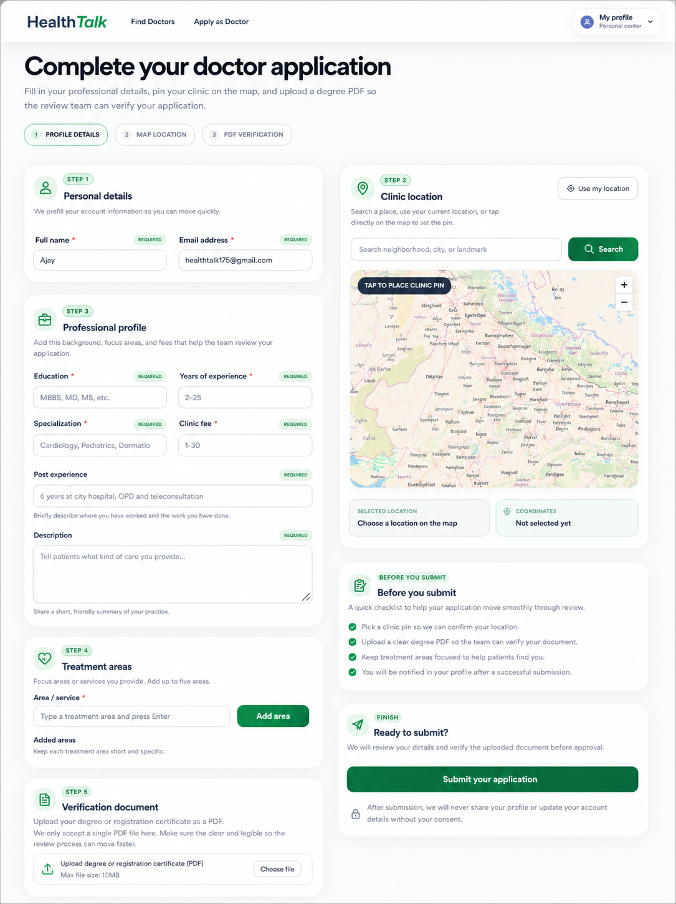
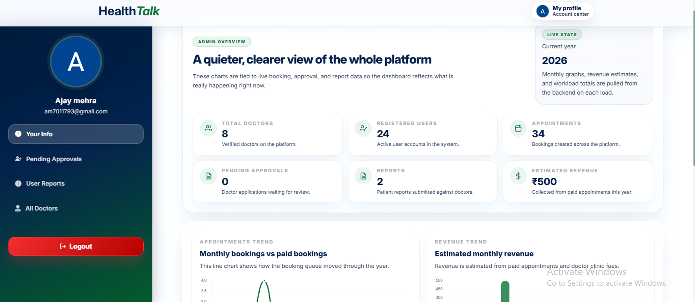

# HealthTalk

HealthTalk is a role-based healthcare booking platform that connects patients with verified doctors, gives doctors tools to manage appointments and earnings, and provides admins with a moderation dashboard.

## Why This Project Stands Out

- Public landing page with a branded hero section, doctor previews, testimonials, FAQ, and a polished footer
- Verified doctor profiles with smart filters for rating, price, and nearby clinics
- Doctor profile pages with booking, reporting, and review entry points
- Patient profile area for editing personal details and tracking appointments
- Doctor workspace for managing appointment queues, visit times, reviews, and earnings
- Admin tools for approvals, doctor management, report moderation, and platform analytics
- Secure auth flow with Google OAuth, email/password login, OTP-based signup verification, and protected routes
- Stripe checkout flow with webhook-driven payment updates
- Responsive UI built with Chakra UI, Framer Motion, and custom design layers

## Screenshots

### Home / Landing Page


### Doctor Directory


### Doctor Profile / Booking


### Doctor Form


### Admin Dashboard


## Feature Overview

### For Patients

- Browse verified doctors from the home page or the full directory
- Filter doctors by rating, consultation fee, or location
- Use nearby search to find doctors close to the current location
- Open detailed doctor profiles and book appointments
- Pay for appointments through Stripe checkout
- Track appointment status, payment status, and doctor details from a personal dashboard
- Submit reviews and reports when needed

### For Doctors

- Receive and manage patient appointments in a dedicated workspace
- Set appointment times from the doctor queue
- Track completed appointments and earnings
- Review patient feedback from a clean review panel
- Update doctor profile details and clinic information

### For Admins

- Review doctor applications and approve or reject requests
- View all doctors in the platform directory
- Moderate user reports
- See overview charts for users, doctors, bookings, and revenue
- Delete doctor records when needed

### Doctor Application Flow

- Submit personal and professional details
- Upload a degree PDF
- Pick treatment areas
- Choose a clinic location using a map-based picker
- Search for a location or use the current location

## Tech Stack

- Frontend: React 18, React Router, Chakra UI, Framer Motion, Axios, Chart.js, MapLibre GL, React DatePicker, React Icons, Stripe.js, Google OAuth
- Backend: Node.js, Express, MongoDB, Mongoose, JWT, Stripe, Nodemailer, Passport Google OAuth, Multer, Sharp, Cloudinary
- UI and data patterns: role-based routing, geolocation, OTP verification, responsive layouts, animated cards, and API data

## Project Structure

- `client/` React frontend
- `client/src/pages/` top-level pages
- `client/src/components/` reusable UI and feature components
- `client/src/context/` auth state management
- `client/src/hooks/` route guards and helpers
- `server/` Express backend
- `server/controller/` request handlers
- `server/routes/` API endpoints
- `server/model/` MongoDB schemas
- `server/middlewares/` upload and auth helpers

## Running Locally

1. Install dependencies in both `client/` and `server/`.
2. Add the required environment variables.
3. Start the backend and frontend in separate terminals.

```bash
cd server
npm install
npm run dev
```

```bash
cd client
npm install
npm start
```

## Environment Variables

### Client

```env
REACT_APP_API_URL=http://localhost:5000
REACT_APP_OAUTH_CLIENT_ID=your_google_oauth_client_id
REACT_APP_GEOAPIFY_API_KEY=your_geoapify_api_key
```

### Server

```env
PORT=5000
BASE_URL=http://localhost:3000
MONGO_URL=your_mongodb_connection_string
JWT_SECRET=your_jwt_secret
CLIENT_ID=your_google_client_id
CLIENT_SECRET=your_google_client_secret
STRIPE_SECRET=your_stripe_secret_key
WEBHOOK_SECRET=your_stripe_webhook_secret
Email_Username=your_smtp_email
Email_Password=your_smtp_password
ADMIN_EMAIL=your_admin_email
CLOUDINARY_CLOUD_NAME=your_cloudinary_cloud_name
CLOUDINARY_API_KEY=your_cloudinary_api_key
CLOUDINARY_API_SECRET=your_cloudinary_api_secret
```

## Main Routes

- `/` home page
- `/doctors` doctor directory
- `/doctor-profile/:doctorId` doctor profile page
- `/login` and `/signup` authentication pages
- `/my-profile/*` user, doctor, and admin dashboards
- `/doctor/form` doctor application form
- `/doctor/review/:doctorId` review submission page

## Notes

- The app uses live backend data for doctors, bookings, reviews, reports, approvals, and earnings.

## Contact

If you'd like to connect or discuss opportunities:

- 📧 Email: [ajaymehra4492@gmail.com](mailto:ajaymehra4492@gmail.com)  
- 💼 LinkedIn: [Ajay Mehra](https://www.linkedin.com/in/ajay-mehra-9b8842259/)